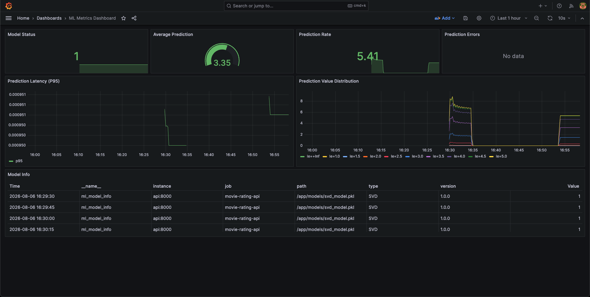
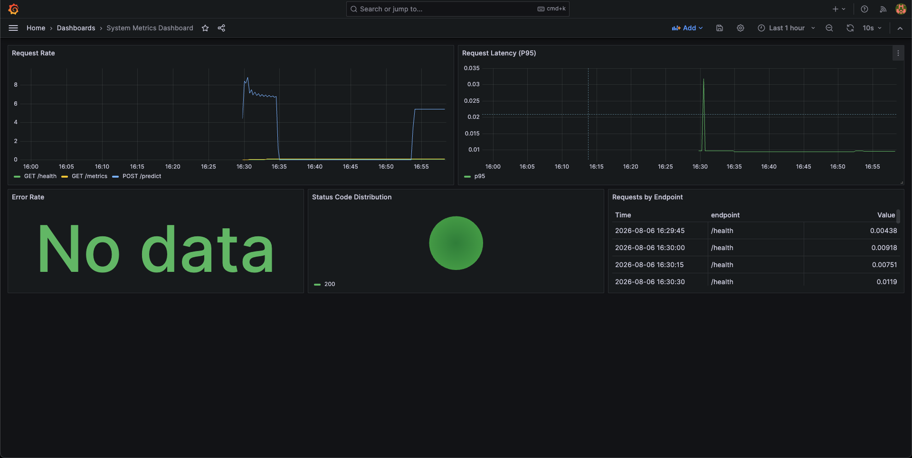

# DDM501 Lab 4 - Monitoring & Production Deployment (Group 4)

## General Information

**Lecturer**: Huynh Cong Viet Ngu  
**Group**: Group 4

| Full Name | MSSV | Role |
| --- | --- | --- |
| Le Thi Kim Chi | 25MS23290 | Team lead |
| Truong Quoc Khanh | 25MS23285 | Member |
| Truong Sy Quang | 25MS23286 | Member |
| Nguyen Viet Anh Minh | 25MS23275 | Member |

---

## Overview

This lab implements an end-to-end monitoring stack for the movie rating prediction API:

- Application and ML metrics instrumentation
- Prometheus scraping and alerting rules
- Grafana dashboards (System + ML)
- Load testing for observability validation

## Deliverables Coverage

### 1. Instrumented Application

- Exposed metrics endpoint: `/metrics`
- HTTP metrics: `http_requests_total`, `http_request_duration_seconds`
- ML metrics: `ml_predictions_total`, `ml_prediction_duration_seconds`, `ml_prediction_value`, `ml_prediction_errors_total`, `ml_model_loaded`
- Health and prediction endpoints available: `/health`, `/predict`, `/predict/batch`

### 2. Prometheus Setup

- Scrape config implemented for API target `api:8000`
- Alert rules loaded from `prometheus/alerts/*.yml`
- Prometheus runs in Docker with persistent volume

### 3. Grafana Dashboards

- Dashboard 1: `System Metrics Dashboard`
- Dashboard 2: `ML Metrics Dashboard`
- Provisioned data source and dashboard auto-loading enabled

### 4. Alert Rules

Implemented alerts (>= 5 required):

1. `HighErrorRate`
2. `HighLatency`
3. `ServiceDown`
4. `ModelNotLoaded`
5. `PredictionLatencyHigh`
6. `LowPredictionVolume`

### 5 Load Test Results

- Load test script: `scripts/load_test.py`
- Supports single and batch prediction traffic
- Reports total requests, success rate, throughput, and latency percentiles (P50/P95/P99)
- Screenshot evidence should be saved in `screenshots/`

### 6. Documentation

This README provides:

- Setup instructions
- Monitoring stack runbook
- Dashboard guide
- Load-test verification workflow

## Project Structure

```
ddm501-lab4-starter/
├── app/
│   ├── __init__.py
│   ├── main.py             # FastAPI application with metrics
│   ├── model.py            # ML model with instrumentation
│   ├── schemas.py          # Pydantic schemas
│   ├── config.py           # Configuration
│   ├── metrics.py          # Prometheus metrics
│   └── middleware.py       # Metrics middleware
├── prometheus/
│   ├── prometheus.yml      # Prometheus config
│   └── alerts/
│       ├── api_alerts.yml  # API alerting rules
│       └── ml_alerts.yml   # ML alerting rules
├── grafana/
│   ├── provisioning/
│   │   ├── datasources/
│   │   │   └── prometheus.yml  # Data source config
│   │   └── dashboards/
│   │       └── dashboards.yml  # Dashboard provisioning
│   └── dashboards/
│       ├── system_dashboard.json   # System metrics
│       └── ml_dashboard.json       # ML metrics
├── scripts/
│   ├── train_model.py      # Model training
│   └── load_test.py        # Load testing script
├── tests/
│   └── test_metrics.py     # Metrics tests
├── models/                 # Saved models
├── docker-compose.yml      # Full stack deployment
├── Dockerfile
├── requirements.txt
└── README.md
```

## Implementation Guide

### 1. Clone and set up the environment

```bash
cd ddm501-lab4-starter

# Create virtual environment
python -m venv venv
source venv/bin/activate       # macOS / Linux
# venv\Scripts\activate        # Windows

# Install dependencies
pip install -r requirements.txt
```

### 2. Prepare & Train the Model (If not exist)

```bash
python scripts/train_model.py
```

### 3. Run API Locally
Run FastAPI development server:

```bash
uvicorn app.main:app --reload --host 0.0.0.0 --port 8000
```

### 4. Start Full Monitoring Stack

```bash
docker compose up -d
```

### 5. Access Services

| Service | URL | Credentials | Screenshot |
|---------|-----|-------------|-------------|
| API | http://localhost:8000 | - ||
| API Docs | http://localhost:8000/docs | - |-------------|
| Metrics | http://localhost:8000/metrics | - |-------------|
| Prometheus | http://localhost:9090 | - |-------------|
| Grafana | http://localhost:3000 | admin/admin |-------------|

## Implementation Status

## Dashboard Guide

The System Metrics Dashboard tracks request rate, P95 request latency, HTTP error rate,
status-code distribution, and traffic by endpoint. The ML Metrics Dashboard tracks model
availability, prediction rate, P95 prediction latency, prediction value distribution,
average prediction, prediction errors, and model metadata.

The dashboards use the provisioned Prometheus datasource and are loaded automatically by
Grafana. Main queries include `rate(http_requests_total[5m])`,
`histogram_quantile(0.95, rate(http_request_duration_seconds_bucket[5m]))`,
`rate(ml_predictions_total[5m])`, and
`histogram_quantile(0.95, rate(ml_prediction_duration_seconds_bucket[5m]))`.



## Load Test

```bash
python scripts/load_test.py --duration 60 --workers 10
python scripts/load_test.py --duration 60 --workers 10 --batch
```

The script checks API health and reports totals, success rate, throughput, and P50/P95/P99
latency. Use this traffic to capture Grafana screenshots. 

## Metrics to Implement

### Application Metrics
| Metric | Type | Description |
|--------|------|-------------|
| `http_requests_total` | Counter | Total HTTP requests |
| `http_request_duration_seconds` | Histogram | Request latency |

### ML Metrics
| Metric | Type | Description |
|--------|------|-------------|
| `ml_predictions_total` | Counter | Total predictions |
| `ml_prediction_duration_seconds` | Histogram | Prediction latency |
| `ml_prediction_value` | Histogram | Prediction distribution |
| `ml_model_loaded` | Gauge | Model status |
| `ml_prediction_errors_total` | Counter | Prediction errors |

## Alert Rules to Implement

| Alert | Condition | Severity |
|-------|-----------|----------|
| HighErrorRate | Error rate > 10% | Critical |
| HighLatency | P95 latency > 1s | Warning |
| ModelNotLoaded | Model status = 0 | Critical |
| PredictionLatencyHigh | P95 > 100ms | Warning |
| LowPredictionVolume | Rate < 0.1/s | Warning |

## Useful PromQL Queries

```promql
# Request rate
rate(http_requests_total[5m])

# Error rate percentage
rate(http_requests_total{status=~"5.."}[5m]) / rate(http_requests_total[5m]) * 100

# P95 latency
histogram_quantile(0.95, rate(http_request_duration_seconds_bucket[5m]))

# Prediction rate
rate(ml_predictions_total[5m])

# Average prediction value
histogram_quantile(0.5, rate(ml_prediction_value_bucket[5m]))
```
